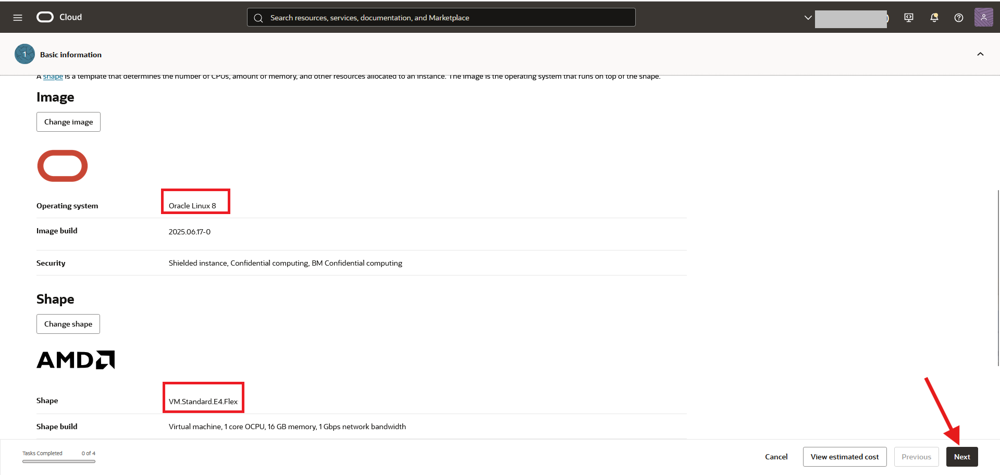
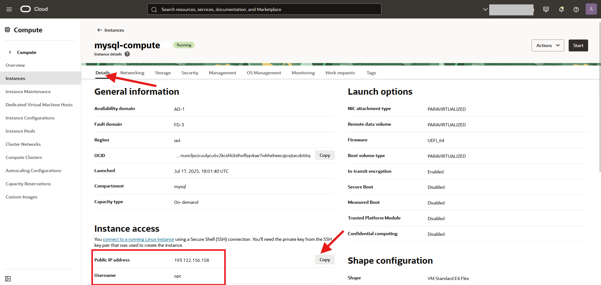

# Create a Compute Instance


## Introduction

Oracle Cloud Infrastructure Compute lets you provision and manage compute hosts, known as instances. You can create instances as needed to meet your compute and application requirements. After you create an instance, you can access it securely from your computer or cloud shell.


_Estimated Time:_ 10 minutes

### Objectives

In this lab, you will be guided through the following task:

- Create Compute Instance

### Prerequisites

- You have completed Lab 1.

## Task 1: Create a Compute Instance

You need a compute instance to connect to perform the database and application tasks. 

1. Click the **Navigation menu** in the upper left, navigate to **Compute**, and under **Compute**, select **Instances**.
  
    

2. Ensure **mysql** compartment is selected, and click **Create instance**. 

     

3. On **Create compute instance** page, enter the name of the compute instance.

    ```bash
    <copy>mysql-compute</copy>
    ```

4. Ensure **mysql** compartment is selected.

5. In the **Placement** field, keep the selected **Availability domain**.

    

6. In the **Image and Shape** field, keep the selected image, **Oracle Linux 9**, and the default shape, and click **Next**.

    

7. Under **Security** panel, click **Next**.

8. Under **Networking** panel, in **Primary network** field, select **Select existing virtual cloud network**, and ensure the following settings are selected:

    - **Virtual cloud network compartment**: **mysql**

    - **Virtual cloud network**: **mysql-vcn**

9. Under **Subnet**, ensure the following are selected:

    - **Subnet compartment**: **mysql**

    - **Subnet**: **public-subnet-mysql-vcn**

10. In **Primary VNIC IP addresses** field, ensure the following settings are selected:

    - **Private IPv4 address**: **Automatically assign private IPv4 address**

    - **Automatically assign public IPv4 address**: Enabled

    

11. In **Add SSH keys** field, select **Generate a key pair for me** and Click **Download private key** 
  
    

12. Save **private key** in your ssh folder, and rename the key. For example:

    ```bash
    <copy>ssh-key-2025</copy>
    ```

     

13. Click **Next**, and then **Next**.

14. Click **Create** to create your compute instance. 

15. The compute instance will be ready to use after a few minutes. The state is shown as **Provisioning** while the instance is creating.

16. When the compute instance is ready to use, the state is shown as **Running**. *Save* the **Public IP address** and the **Username**.

    

You may now **proceed to the next lab**.


## Acknowledgements

- **Author** - Perside Foster, MySQL Principal Solution Engineering
- **Contributors** 
- Nick Mader, MySQL Global Channel Enablement & Strategy Director, 
- Selena Sanchez, MySQL Staff Solutions Engineer,
- **Last Updated By/Date** - Perside Foster, MySQL Principal Solution Engineering, July   2025
