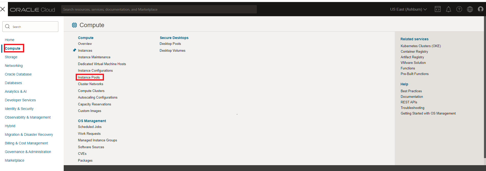
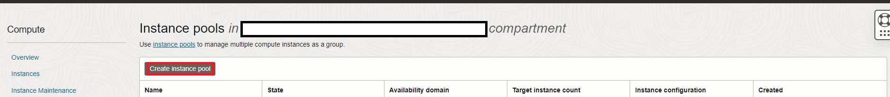
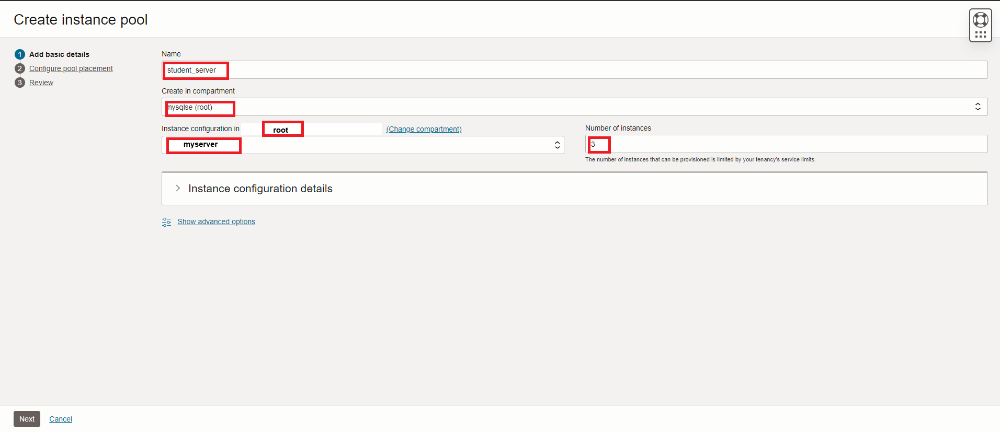
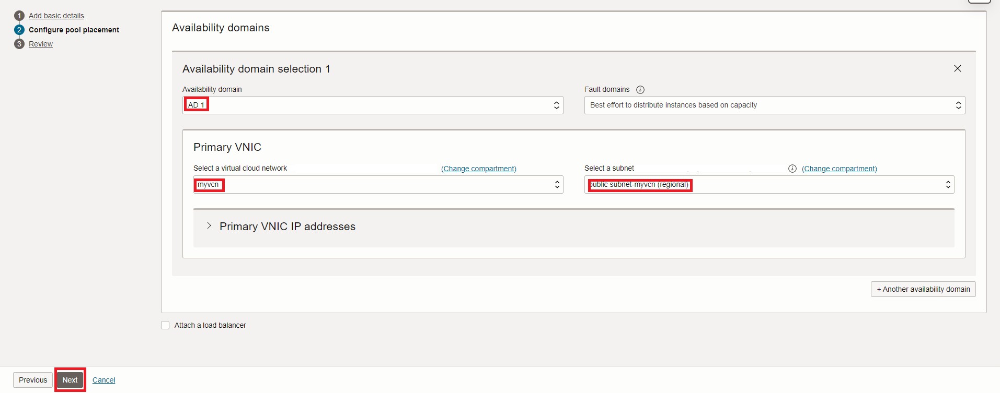
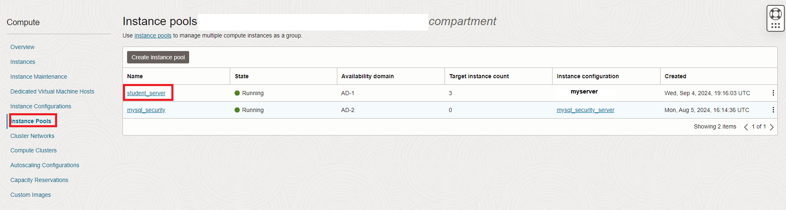
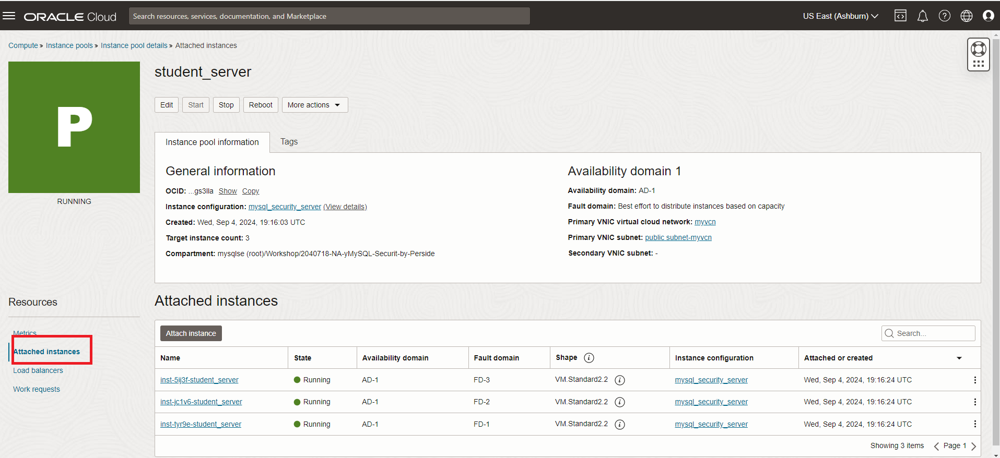

# Create Compute Instance Pool

## Introduction

Create Compute instances for the students to use in class. You can delete them at the end of the workshop.
Instance pools let you create and manage multiple compute instances within the same region as a group. 

**Create Linux Compute Instance**

In this lab you will  scale an existing instance by configuring it into an instance pool with  additional instances on Oracle Cloud Infrastructure. 

_Estimated Time:_ 10 minutes


### Objectives

In this lab, you will be guided through the following task:

- Create an Instance Pool with 3 New Instances

### Prerequisites

- An Oracle Free Tier or Paid Cloud Account
- A web browser
- Pre-configured instance setup including image, shape, and networking
- Should have completed Lab 2

## Task 1: Create a New Instance Pool

1. From the Oracle Cloud console, open the navigation menu and select Compute > Instance Pools.
    
2. Click Create Instance Pool.
    

3. Enter the following details:
    - Name: Provide a name for your instance pool.

    ```
    <copy>student_server</copy>
    ```
    - Compartment: Make sure **(root)** compartment is selected
    - Placement: Keep the selected Availability Domain

4. Configure Instances:
    - Number of Instances: Set this to 3 to create five instances in the pool.
    - Instance Configuration: Select the **myserver**  instance that was created in the previous lab
    
5. Click next. 
6. Choose the appropriate VCN and subnet for the instances.
    
7. Click next. 

## Task 2: Create and verify Instance Pool Creation

1. Review all settings and click Create Instance Pool.
2. The pool will automatically create the specified number of instances (3) based on the configuration 
3. Once the instance pool is created, the status should show Running for all instances within the pool.
4. You can manage and monitor the instances from the Instance Pools section of the console.
    
5. To view the  created instances select the **student_server** instance pool and click attached instances
    
6. Select each instance and copy their Public IP address to share with the students.
7. Share the SSH private key from the previous lab with each of the students.

You may now **proceed to the next lab**

## Acknowledgements

- **Author** - Perside Foster, MySQL Solution Engineering
- **Last Updated By/Date** - <Perside Foster, MySQL Solution Engineering, September 2024
