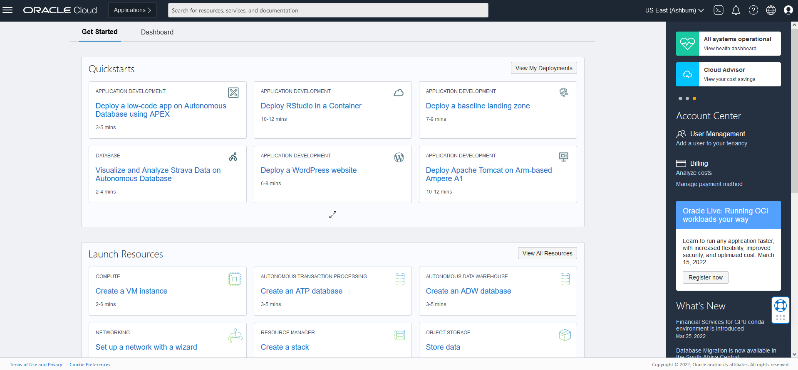
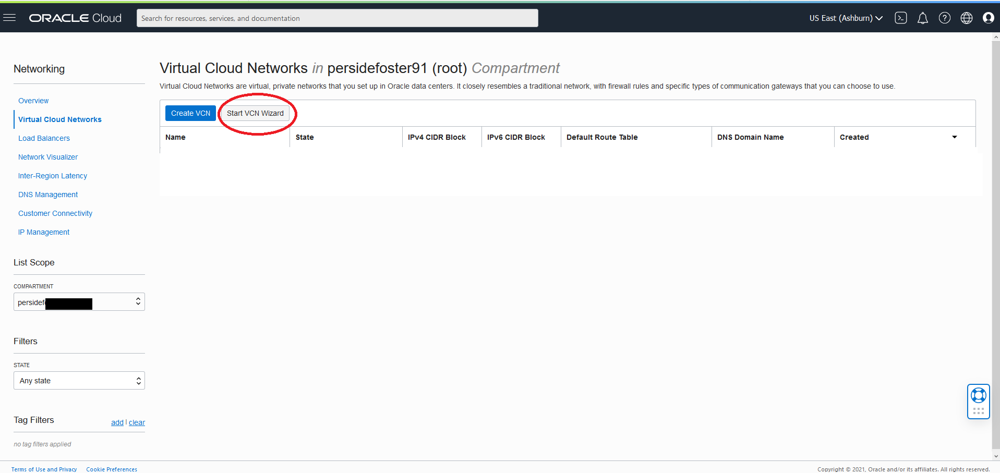
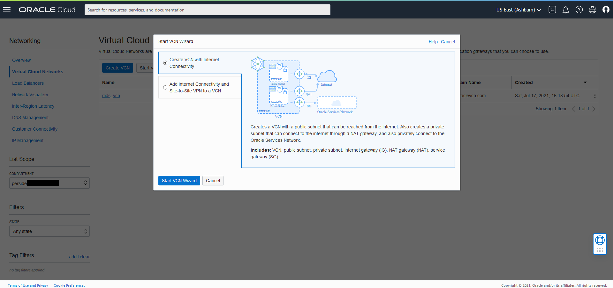
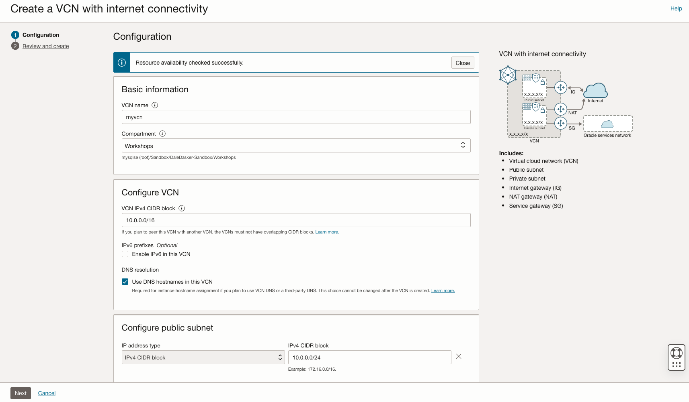
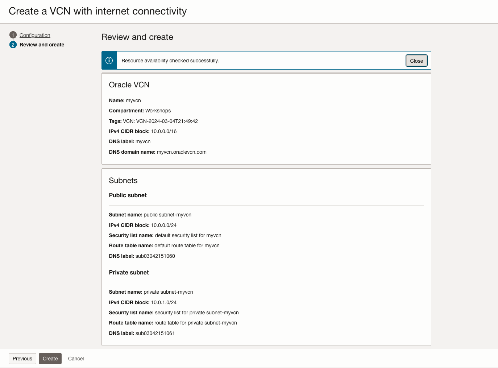
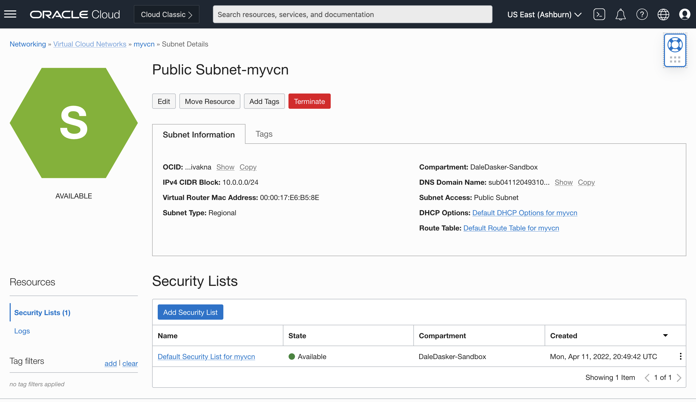
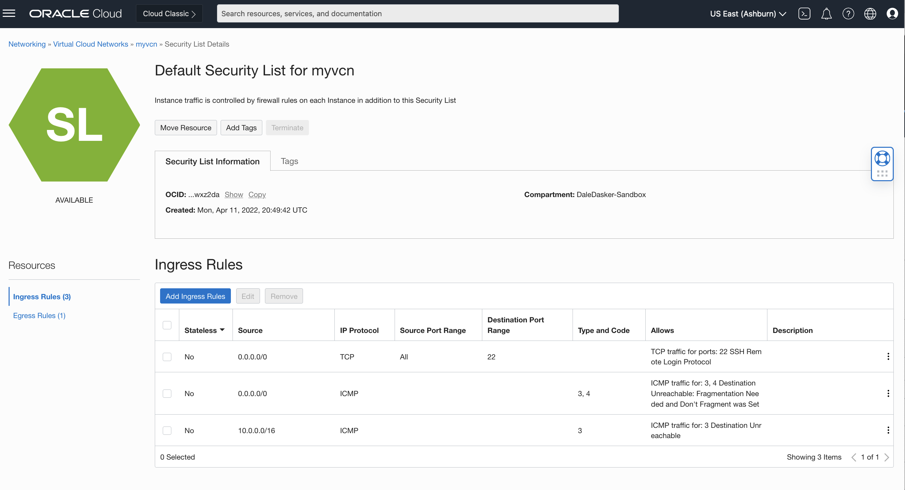
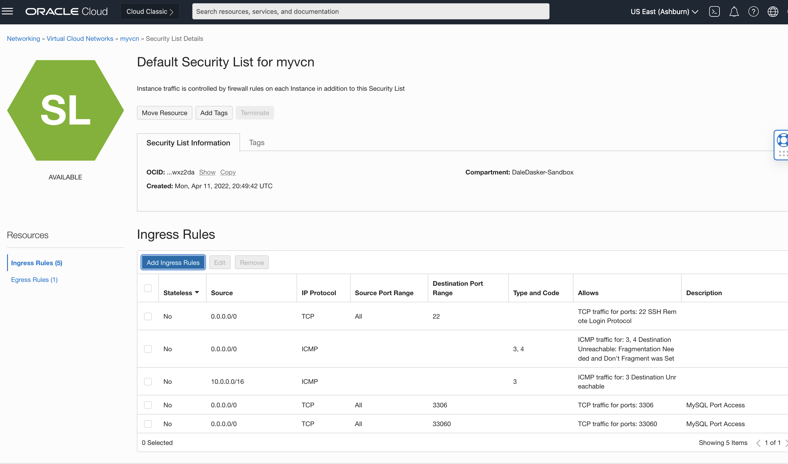

# Create your Virtual Cloud Network and Related Components

## Introduction

Set up a Virtual Cloud Network (VCN) to connect your Linux instance to the internet. You will configure all the components needed to create your virtual network.

_Estimated Time:_ 10 minutes

### Objectives

In this lab, you will be guided through the following tasks:

- Create Virtual Cloud Network
- Configure security list to allow MySQL incoming connections

### Prerequisites

- An Oracle Free Tier or Paid Cloud Account
- A web browser
- Login to OCI to land on OCI Dashboard (This image shows a trial account)



## Task 1: Create Virtual Cloud Network

1. Click Navigation Menu
    Select Networking  
    Select Virtual Cloud Networks
    

2. Click **Start VCN Wizard**
    

3. Select 'Create VCN with Internet Connectivity'

    Click 'Start VCN Wizard'
    

4. Create a VCN with Internet Connectivity

    On Basic Information, complete the following fields:

    VCN Name:

    ```bash
    <copy>myvcn</copy>
    ```

    Compartment: Select  **(root)**

    Your screen should look similar to the following
    

5. Click 'Next' at the bottom of the screen

6. Review Oracle Virtual Cloud Network (VCN), Subnets, and Gateways

    Click 'Create' to create the VCN
    

7. The Virtual Cloud Network creation is completing
    

8. Click 'View Virtual Cloud Network' to display the created VCN
    

## Task 2: Configure security list to allow MySQL incoming connections

1. On myvcn page under 'Subnets in (root) Compartment', click  '**Public Subnet-myvcn**'
     

2. On Public Subnet-myvcn page under 'Security Lists',  click  '**Security List for Public Subnet-myvcn**'
    

3. On Security List for Public Subnet-myvcn page under 'Ingress Rules', click '**Add Ingress Rules**'
    

4. On Add Ingress Rules page under Ingress Rule 1

    Add an Ingress Rule with Source CIDR

    ```bash
    <copy>0.0.0.0/0</copy>
    ```

    Destination Port Range

    ```bash
    <copy>3306,33060</copy>
     ```

    Description

    ```bash
    <copy>MySQL Port Access</copy>
     ```

    Click 'Add Ingress Rule'
    

5. On Security List for Public Subnet-myvcn page, the new Ingress Rules will be shown under the Ingress Rules List
    

## Task 3: Configure security list to allow HTTP incoming connections

1. Click Add Ingress Rules page under Ingress Rule

    

    Add an Ingress Rule with Source CIDR

    ```bash
    <copy>0.0.0.0/0</copy>
    ```

    Destination Port Range

    ```bash
    <copy>80,443</copy>
    ```

    Description

    ```bash
    <copy>Allow HTTP connections</copy>
    ```

    Click 'Add Ingress Rule'
    

2. On Security List for Public Subnet-myvcn page, the new Ingress Rules will be shown under the Ingress Rules List

    

You may now **proceed to the next lab**

## Acknowledgements

- **Author** - Dale Dasker, MySQL Solution Engineering

- **Last Updated By/Date** - <Dale Dasker, March 2024
