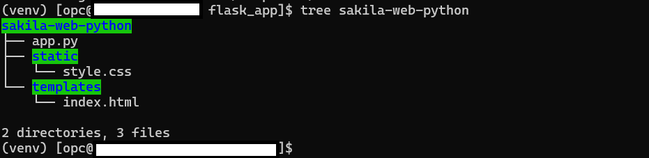
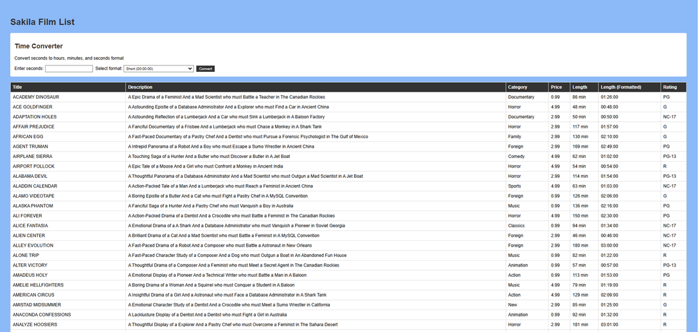

# Build and Test Web Application - LMPF: Linux, MySQL, Python, Flask

## Introduction

**Important:** You can install the Python (LMPF) stack or either the PHP (LAMP) stack on this server — not both. 

MySQL Enterprise Edition integrates seamlessly with the LMPF (Linux, MySQL, Python, Flask) stack, enhancing open-source capabilities with enterprise features. MySQL EE works with the LMPF stack by:

- Running JavaScript functions in database
- Using secure PHP connections (PDO)
- Maintaining Apache/Linux compatibility

After installing the LMPF Stack , you will Deploy and test the "Sakila Film Library with Time Converter" web application. This application displays the Sakila.Film data while providing a time conversion tool. Users can enter seconds and convert them to either HH:MM:SS format or written time descriptions using MySQL Enterprise Edition's JavaScript function. This LMPF-based application demonstrates practical use of database features within MySQL Enterprise Edition.

**Note:** The application code in this lab is intended for educational purposes only. It is designed to help developers learn and practice application development skills with MySQL Enterprise Edition. The code is not designed to be used in a production environment

_Estimated Lab Time:_ 15 minutes

### Objectives

In this lab, you will be guided through the following tasks:

- Install  Python and Flask
- Deploy the Sample LMPF WEB Application

### Prerequisites

- An Oracle Trial or Paid Cloud Account
- Some Experience with MySQL SQL and  Python
- Completed Lab 3

## Task 1: Setup Python Flask Environment

1. Go to home folder

    ```bash
    <copy>cd /home/opc</copy>
    ```

2. Verify that the PHP (LAMP) stack has not already been installed on this server.

    ```bash
    <copy>php -v 2>/dev/null

    if [ $? -eq 0 ]; then
        echo "PHP is installed. You cannot install the Python (LMPF) stack. Please exit this Lab"
    else
        echo "PHP is not installed. You may proceed to install the Python (LMPF) stack."
    fi </copy>   
    ```


3. Install Python

    ```bash
    <copy>sudo dnf install python39 python39-devel python39-pip -y</copy>
    ```

4. Install required packages

    ```bash
    <copy>sudo dnf install gcc -y</copy>
    ```

5. Create a virtual environment

    ```bash
    <copy>sudo mkdir /var/www</copy>
    ```

    ```bash
    <copy>sudo mkdir /var/www/flask_app</copy>
    ```

    ```bash
    <copy>cd /var/www/flask_app</copy>
    ```

    ```bash
    <copy>sudo python3.9 -m venv venv</copy>
    ```

    ```bash
    <copy>source venv/bin/activate</copy>
    ```

6. Set proper permissions

    ```bash
    <copy>sudo chown -R $(whoami):$(whoami) /var/www/flask_app</copy>
    ```

7. Install Flask and related packages

    ```bash
    <copy>pip install flask flask-sqlalchemy pymysql cryptography gunicorn</copy>
    ```

8. Set up Gunicorn as a service

    ```bash
    <copy>sudo nano /etc/systemd/system/flask_app.service</copy>
    ```

   Add the following:

    ```bash
    <copy>[Unit]
    Description=Gunicorn instance to serve Flask application
    After=network.target

    [Service]
    User=apache
    Group=apache
    WorkingDirectory=/var/www/flask_app
    Environment="PATH=/var/www/flask_app/venv/bin"
    ExecStart=/var/www/flask_app/venv/bin/gunicorn --workers 3 --bind 0.0.0.0:5000 app:app

    [Install]
    WantedBy=multi-user.target</copy>
    ```

9. Enable and start Flask

    ```bash
    <copy>sudo systemctl enable flask_app</copy>
    ```

    ```bash
    <copy>sudo systemctl start flask_app</copy>
    ```

10. Configure firewall

    ```bash
    <copy>sudo firewall-cmd --permanent --add-port=5000/tcp </copy>
    ```

    ```bash
    <copy>sudo firewall-cmd --reload</copy>
    ```

## Task 2: Deploy and Run Sakila Film Web / MySQL JavaScript Stored Function Application

1. Go to the development folder

    ```bash
    <copy>cd /var/www/flask_app/</copy>
    ```

2. Download application code

    ```bash
    <copy> sudo wget https://objectstorage.us-ashburn-1.oraclecloud.com/p/ojnCuO6Nk8l9tVyocciB9GpJgYR5CyZZ_bgr2-emm9lGxn-Tdf1rqeHd1NgcjgdQ/n/idazzjlcjqzj/b/livelab_apps/o/sakila-web-python.zip</copy>
    ```

3. unzip Application code

    ```bash
    <copy>sudo unzip sakila-web-python.zip</copy>
    ```

    ```bash
    <copy>tree sakila-web-python</copy>
    ```

    - Application directory structure:

    

4. Update file app.py  to change the following values if needed

    - DB_CONFIG = {
        - 'host': 'localhost', # Change this if your MySQL server is hosted elsewhere
        - 'user': 'admin', # Change this to your MySQL username
        - 'password': '', # Change this to your MySQL password
        - 'db': 'sakila',
        - 'charset': 'utf8mb4',
        - 'cursorclass': DictCursor
    - }

    ```bash
    <copy>cd sakila-web-python</copy>
    ```

    ```bash
    <copy>sudo nano  app.py</copy>
    ```

5. Execute the Python script "app.py" using the Python interpreter.

    ```bash
    <copy>python app.py</copy>
    ```

6. Run the application from your browser as follows (Replace 127.0.0.1 with your IP address ):

    http://150.136...:5000 

    

7. Test the application with following examples(Enter seconds, then select **short** or **long** format):

    a. Test Case 1 - Movie Length:
    - Input: 7200 seconds (typical movie)
    - Short format: 02:00:00
    - Long format: 2 hours

    b. Test Case 2 - TV Episode:
    - Input: 1350 seconds (22.5 minute show)
    - Short format: 00:22:30
    - Long format: 22 minutes 30 seconds

    c. Test Case 3 - Long Film:
    - Input: 18105 seconds (Lord of the Rings style)
    - Short format: 05:01:45
    - Long format: 5 hours 1 minute 45 seconds

    d. Test Case 4 - Short Clip:
    - Input: 90 seconds (quick scene)
    - Short format: 00:01:30
    - Long format: 1 minute 30 seconds


## Learn More

- [Install Flask on an Ubuntu VM](https://docs.oracle.com/en-us/iaas/developer-tutorials/tutorials/flask-on-ubuntu/01oci-ubuntu-flask-summary.htm#install-flask-ubuntu)


## Acknowledgements

- **Author** - Perside Foster, MySQL Solution Engineering
- **Contributor** - Nick Mader, MySQL Global Channel Enablement & Strategy Director,
Selena Sanchez, MySQL Staff Solutions Engineer 
- **Last Updated By/Date** - Perside Foster, MySQL Solution Engineering, April  2025