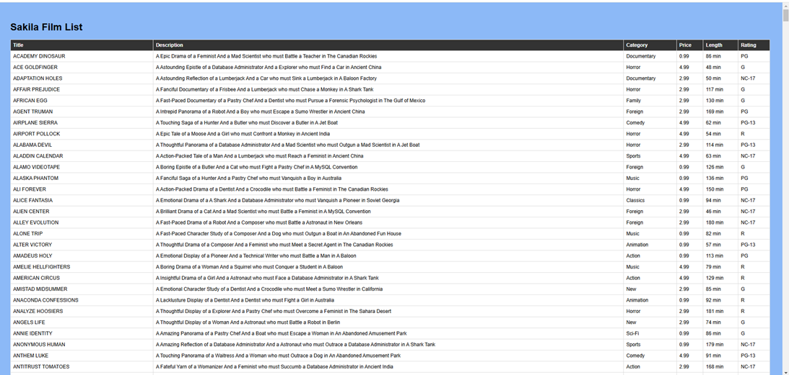

# Build and Test Apache/ PHP/ MySQL Web Application

## Introduction

MySQL Enterprise Edition integrates seamlessly with the LAMP (Linux, Apache, MySQL, PHP) stack, enhancing open-source capabilities with enterprise features. MySQL EE works with the LAMP stack by:

- Running JavaScript functions in database
- Using secure PHP connections (PDO)
- Maintaining Apache/Linux compatibility

**Note:** The application code in this lab is intended for educational purposes only. It is designed to help developers learn and practice application development skills with MySQL Enterprise Edition. The code is not designed to be used in a production environment

_Estimated Lab Time:_ 15 minutes

### Objectives

In this lab, you will be guided through the following tasks:

- Install Apache and PHP
- Create PHP / MYSQL Connect Application
- Deploy  LAMP WEB Application

### Prerequisites

- An Oracle Trial or Paid Cloud Account
- Some Experience with MySQL SQL and  PHP
- Completed Lab 3

## Task 1: Install App Server (APACHE)

1. If not already connected with SSH, on Command Line, connect to the Compute instance using SSH ... be sure replace the  "private key file"  and the "new compute instance ip"

     ```bash
    <copy>ssh -i private_key_file opc@new_compute_instance_ip</copy>
     ```

2. Install app server

    a. Install Apache

    ```bash
    <copy>sudo yum install httpd -y </copy>
    ```

    b. Enable Apache

    ```bash
    <copy>sudo systemctl enable httpd</copy>
    ```

    c. Start Apache

    ```bash
    <copy>sudo systemctl restart httpd</copy>
    ```

    d. Setup firewall

    ```bash
    <copy>sudo firewall-cmd --permanent --add-port=80/tcp</copy>
    ```

    e. Reload firewall

    ```bash
    <copy>sudo firewall-cmd --reload</copy>
    ```

3. From a browser test apache from your loacal machine using the Public IP Address of your Compute Instance

    **Example: http://129.213....**

## Task 2: Install PHP

1. Install php:

    a. Install php:8.2

    ```bash
    <copy> sudo dnf install @php:8.2 -y</copy>
    ```

    b. Install associated php libraries

    ```bash
    <copy>sudo yum install php-cli php-mysqlnd php-zip php-gd php-mbstring php-xml php-json -y</copy>
    ```

    c. View  php / mysql libraries

    ```bash
    <copy>php -m |grep mysql</copy>
    ```

    d. View php version

    ```bash
    <copy>php -v</copy>
    ```

    e. Restart Apache

    ```bash
    <copy>sudo systemctl restart httpd</copy>
    ```

2. Create test php file (info.php)

    ```bash
    <copy>sudo nano /var/www/html/info.php</copy>
    ```

3. Add the following code to the editor and save the file (ctr + o) (ctl + x)

    ```bash
    <copy><?php
    phpinfo();
    ?></copy>
    ```

4. From your local machine, browse the page info.php

   Example: http://129.213.167.../info.php

## Task 3: Create MySQL / PHP connect app

1. Security update"   set SELinux to allow Apache to connect to MySQL

    ```bash
    <copy> sudo setsebool -P httpd_can_network_connect 1 </copy>
    ```

2. Create config.php

    ```bash
    <copy>cd /var/www/html</copy>
    ```

    ```bash
    <copy>sudo nano config.php</copy>
    ```

3. Add the following code to the editor, change DB_PASSWORD, and save the file (ctr + o) (ctl + x)

    ```bash
    <copy>
    <?php
    // Database credentials
    define('DB_SERVER', 'localhost');//
    define('DB_USERNAME', 'admin');
    define('DB_PASSWORD', 'Welco...');
    define('DB_NAME', 'mysql');
    //Attempt to connect to database
    $link = mysqli_connect(DB_SERVER, DB_USERNAME, DB_PASSWORD, DB_NAME);
    // Check connection
    if($link === false){
        die("ERROR: Could not connect to the MySQL instance. " . mysqli_connect_error());
    }
    // Print host information
    echo 'Successfully connected to the MySQL instance.';
    echo 'Host info: ' . mysqli_get_host_info($link);
    ?>
    </copy>
    ```

    - Test Config.php on Web sever http://150.230..../config.php

4. Create dbtest.php

    ```bash
    <copy>cd /var/www/html</copy>
    ```

    ```bash
    <copy>sudo nano dbtest.php</copy>
    ```

5. Add the following code to the editor and save the file (ctr + o) (ctl + x)

    ```bash
    <copy>
    <?php
    require_once "config.php";
    $query = "SELECT user FROM mysql.user;";
    if ($stmt = $link->prepare($query)) {
    $stmt->execute();
    $stmt->bind_result($user);
    echo "<table>";
        echo "<tr>";
        echo "<th>User</th>";
    echo "</tr>";

    while ($stmt->fetch()) {
        echo "<tr>";
        echo "<td>" . $user ."</td>";
        echo "</tr>";
    }

    $stmt->close();
    }
    ?>
    </copy>
    ```

6. From your local  machine connect to dbtest.php

    Example: http://129.213.167..../dbtest.php  

## Task 4: Deploy Sakila Film Web / MySQL JavaScript Function Application

The "Sakila Film Time Converter" is a web app that shows films from the Sakila database and converts time formats. Uses a MySQL JavaScript function to convert seconds into either "00:00:00" format or "X hours Y minutes Z seconds".
    **Features**
    - Film library display
    - Time format converter
    - Film length shown in both minutes and HH:MM:SS

1. Go to the development folder

    ```bash
    <copy>cd /var/www/html</copy>
    ```

2. Download application code

    ```bash
    <copy> sudo wget https://objectstorage.us-ashburn-1.oraclecloud.com/p/Ebnl0Yd1YwZkXBiQYZQu6nljiMWSTb9TdhZd4fF9SNGILS_QkYgr_q8E-VBd3x1Z/n/idazzjlcjqzj/b/livelab_apps/o/sakila-web.zip</copy>
    ```

3. unzip Application code

    ```bash
    <copy>sudo unzip sakila-web.zip</copy>
    ```

    ```bash
    <copy>cd sakila-web</copy>
    ```

4. Run the application as follows (Use your coupute IP address):

    http://127.0.0.../sakila-web/

    

## Learn More

- [Install Apache and PHP on an Oracle Linux Instance](https://docs.oracle.com/en-us/iaas/developer-tutorials/tutorials/apache-on-oracle-linux/01-summary.htm)


## Acknowledgements

- **Author** - Perside Foster, MySQL Solution Engineering
- **Contributor** - Nick Mader, MySQL Global Channel Enablement & Strategy Director
- **Last Updated By/Date** - Perside Foster, MySQL Solution Engineering, March  2025