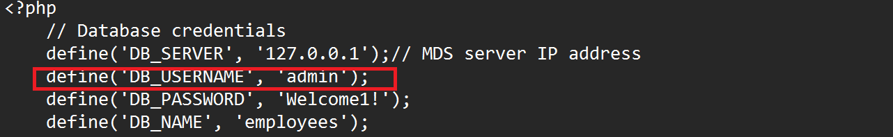
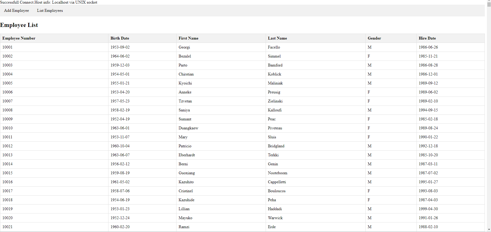

# Setup LAMP Application

## Introduction

MySQL Enterprise Edition  can easily be used for development tasks. Applications can be created with the LAMP or other software stacks.

**Note:** This application code is intended for educational purposes only. It is designed to help developers learn and practice application development skills with MySQL Enterprise Edition. The code is not designed to be used in a production environment

_Estimated Lab Time:_ 15 minutes

### Objectives

In this lab, you will be guided through the following tasks:

- Install Apache and PHP
- Create PHP / MYSQL Connect Application
- Migrate LAMP WEB Application

### Prerequisites

- All previous labs successfully completed

### Lab standard

Pay attention to the prompt, to know where execute the commands 
*  shell>  
  The command must be executed in the Operating System shell
*  mysql>  
  The command must be executed in a client like MySQL, MySQL Shell or similar tool
*  mysqlsh>  
  The command must be executed in MySQL shell


## Task 1: Install App Server (APACHE)

1. Open OCI Cloud Console. If not already connected with SSH, on Command Line, connect to the Compute instance using SSH ... be sure replace the  "private key file"  and the "new compute instance ip"

    ** shell>**
     ```bash
    <copy>ssh -i ~/.ssh/id_rsa opc@<your_compute_instance_ip></copy>
     ```

2. Install app server

    a. Install Apache

    ** shell>**
    ```bash
    <copy>sudo yum install httpd -y </copy>
    ```

    b. Enable Apache

    ** shell>**
    ```bash
    <copy>sudo systemctl enable httpd</copy>
    ```

    c. Start Apache

    ** shell>**
    ```bash
    <copy>sudo systemctl restart httpd</copy>
    ```

    d. Setup firewall to allow HTTP connections

    ** shell>**
    ```bash
    <copy>sudo firewall-cmd --permanent --add-port=80/tcp</copy>
    ```

    e. Reload firewall to activate the new rules

    ** shell>**
    ```bash
    <copy>sudo firewall-cmd --reload</copy>
    ```

3. From a browser test apache from your local machine using the Public IP Address of your Compute Instance

    **Example: http://129.213....**

## Task 2: Install PHP

1. Install php:

    a. Install php:7.4

    ** shell>**
    ```bash
    <copy> sudo dnf module install php:7.4 -y</copy>
    ```

    b. Install php libraries required by our application

    ** shell>**
    ```bash
    <copy>sudo yum install php-cli php-mysqlnd php-zip php-gd php-mbstring php-xml php-json -y</copy>
    ```

    c. View installed php libraries for mysql

    ** shell>**
    ```bash
    <copy>php -m |grep mysql</copy>
    ```

    d. View php version

    ** shell>**
    ```bash
    <copy>php -v</copy>
    ```

    e. Restart Apache

    ** shell>**
    ```bash
    <copy>sudo systemctl restart httpd</copy>
    ```

2. Create test php file (info.php)

    ** shell>**
    ```bash
    <copy>sudo nano /var/www/html/info.php</copy>
    ```

3. Add the following code to the editor and save the file (ctr + o) (ctl + x)

    ** shell>**
    ```bash
    <copy><?php
    phpinfo();
    ?></copy>
    ```

4. From your local machine, browse the page info.php

   Example: http://129.213.167.../info.php

## Task 3: Create MySQL PHP connect app

1. Set SELinux to allow Apache to connect to MySQL

    ** shell>**
    ```bash
    <copy> sudo setsebool -P httpd_can_network_connect 1 </copy>
    ```

2. Create config.php

    ** shell>**
    ```bash
    <copy>cd /var/www/html</copy>
    ```

    ** shell>**
    ```bash
    <copy>sudo nano config.php</copy>
    ```

3. Add the following code to the editor. If needed, please update DB_SERVER with the MySQL DB IP address, the username and password then save the file (ctr + o) (ctl + x)

    ** shell>**
     ```bash
        <copy><?php
    // Database credentials
    define('DB_SERVER', 'localhost');// MDS server IP address
    define('DB_USERNAME', 'admin');
    define('DB_PASSWORD', 'Welcome1!');
    define('DB_NAME', 'mysql');
    //Attempt to connect to MySQL database
    $link = mysqli_connect(DB_SERVER, DB_USERNAME, DB_PASSWORD, DB_NAME);
    // Check connection
    if($link === false){
        die("ERROR: Could not connect. " . mysqli_connect_error());
    }
    // Print host information
    echo 'Successfull Connect.';
    echo 'Host info: ' . mysqli_get_host_info($link);
    ?>
    </copy>
    ```

    - Test Config.php on Web sever http://150.230..../config.php

4. Create dbtest.php

    ** shell>**
    ```bash
    <copy>sudo nano dbtest.php</copy>
    ```

5. Add the following code to the editor and save the file (ctr + o) (ctl + x)

    ** shell>**
    ```bash
    <copy>
    <?php
        require_once "config.php";
        $query = "SELECT user from mysql.user;";
        if ($stmt = $link->prepare($query)) {
            $stmt->execute();
            $stmt->bind_result($user);
            echo "<table>";
            echo "<tr>";
            echo "<th>user</th>";
            echo "</tr>";
            while ($stmt->fetch()) {
            echo "<tr>";
            echo "<td>" . $user ."</td>";
            echo "</tr>";
            }
            $stmt->close();
        }
    ?>
    </copy>
    ```

6. From your local  machine connect to dbhwtest.php

    Example: http://129.213.167..../dbtest.php  

## TASK 4: Add Employyee Web App to server

1. Go to the development folder

    ** shell>**
    ```bash
    <copy>cd /var/www/html</copy>
    ```

2. Download application code

    ** shell>**
    ```bash
    <copy> sudo wget https://objectstorage.us-ashburn-1.oraclecloud.com/p/4joJKyI1NFAXNImd1V-zAV0kOb7pIauzy8QKjMK4BbpBTcYVfkxoAH7HB3P0brMK/n/idazzjlcjqzj/b/mysql_security/o/emp_apps.zip</copy>
    ```

3. unzip Application code

    ** shell>**
    ```bash
    <copy>sudo unzip emp_apps.zip</copy>
    ```

    ** shell>**
    ```bash
    <copy>cd emp_apps</copy>
    ```

4. Replace the DB_USERNAME to **admin** in config.php file and save the file.

    ** shell>**
    ```bash
    <copy>sudo nano config.php</copy>
    ```

    

5. Run the application as follows:

    http://computeIP/emp_apps/list_employees.php

    

You may now **proceed to the next lab**

## Acknowledgements

- **Author** - Perside Foster, MySQL Solution Engineering
- **Last Updated By/Date** - Perside Foster, MySQL Solution Engineering, August 2024