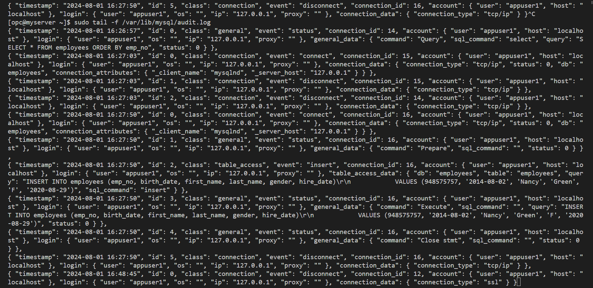

# SECURITY - MYSQL ENTERPRISE AUDIT

## Introduction

MySQL Enterprise Audit
Objective: Auditing in action…

Estimated Lab Time: 20 minutes

### Objectives

In this lab, you will:

* Setup Audit Log
* Use Audit

### Prerequisites

This lab assumes you have:

* All previous labs successfully completed

### Lab standard

Pay attention to the prompt, to know where execute the commands 
*  shell>  
  The command must be executed in the Operating System shell
*  mysql>  
  The command must be executed in a client like MySQL, MySQL Shell or similar tool
*  mysqlsh>  
  The command must be executed in MySQL shell


**Notes:**

* Audit can be activated and configured without stopping the instance. In the lab we edit my.cnf to see how to do it in this way

## Task 1: Setup Audit Log

1. If already connected to MySQL then exit

    ** mysql>**

    ```
        <copy>exit</copy>
    ```

2. Enable Audit Log on mysql-enterprise (remember: you can’t install on mysql-gpl).  Audit is an Enterprise plugin.

     a. Load Audit functions.  If running in a replicated environment, load the plugin no each of the Replicas first and then modify the SQL script to only load the functions.

    ** shell>**

    ```
    <copy>mysql -uadmin -pWelcome1! -h 127.0.0.1 -P 3306 -D mysql < /usr/share/mysql-8.4/audit_log_filter_linux_install.sql</copy>
    ```

    b. Edit the my.cnf setting in /mysql/etc/my.cnf

    ** shell>**

    ```
    <copy>sudo nano /etc/my.cnf</copy>
    ```

    c. Add the following lines to the bottom of the file.  These lines will make sure that the audit plugin can't be unloaded and that the file is automatically rotated at 20 MB and format of data is JSON.

    ** shell>**

    ```
    <copy>plugin-load=audit_log.so
    audit_log=FORCE_PLUS_PERMANENT
    audit_log_rotate_on_size=20971520
    audit_log_format=JSON</copy>
    ```

    d. Restart MySQL (you can configure audit without restart the server, but here we show how to set the configuration file)

    ** shell>**

    ```
    <copy>sudo service mysqld restart</copy>
    ```

3. Connect to your mysql-enterprise with administrative user

    ** shell>**

    ```
    <copy>mysql -uadmin -pWelcome1! -h 127.0.0.1 -P 3306</copy>
    ```

    a. Using the <span style="color:red">Administrative Account</span> , create a Audit Filter for all activity and all users. Privileges required are AUDIT_ADMIN and SUPER

    ** mysql>**

    ```
    <copy>SELECT audit_log_filter_set_filter('log_all', '{ "filter": { "log": true } }');</copy>
    ```

    ** mysql>**

    ```
    <copy>SELECT audit_log_filter_set_user('%', 'log_all');</copy>
    ```

    b. ** mysql>** 
    ```
    <copy>exit</copy>
    ```

    c. Monitor the output of the audit.log file:

    ** shell>**
    ```
    <copy>sudo tail -f /var/lib/mysql/audit.log</copy>
    ```

## Task 2: Use Audit - log all activity and all users

1. Run the application as follows (The application should run):

    <http://computeIP/emp_apps/list_employees.php>

2. Go to the Monitor terminal to view the output of the audit.log file
    

3. Connect to a new instance of the server with SSH

    ```
    <copy>ssh -i ~/.ssh/id_rsa opc@<your_compute_instance_ip></copy>
    ```

4. Login to mysql-enterprise with the user <span style="color:red">appuser1 Connection</span>, then submit some commands

    a. ** shell>**

    ```
    <copy>mysql -u appuser1 -pWelcome1! -h 127.0.0.1 -P 3306</copy>
    ```

    b. ** mysql>**

    ```
    <copy>USE employees;</copy>
    ```

    c. ** mysql>**

    ```
    <copy>SELECT * FROM employees limit 25;</copy>
    ```

    d. ** mysql>**

    ```
    <copy>SELECT emp_no,salary FROM employees.salaries WHERE salary > 90000;</copy>
    ```

5. Go to the Monitor terminal to view the output of the audit.log file

## Task 3: Use Audit - only log connections

1. Let's setup Audit to only log connections. Using the <span style="color:red">Administrative Account</span>, create a Audit Filter for all connections

    ** shell>**

    ```
    <copy>mysql -uadmin -pWelcome1! -h 127.0.0.1 -P 3306</copy>
    ```

    a. ** mysql>**

    ```
    <copy>SET @f = '{ "filter": { "class": { "name": "connection" } } }';</copy>
    ```

    b. ** mysql>**

    ```
    <copy>SELECT audit_log_filter_set_filter('log_conn_events', @f);</copy>
    ```

    c. ** mysql>**

    ```
    <copy>SELECT audit_log_filter_set_user('%', 'log_conn_events');</copy>
    ```

2. Login to mysql-enterprise with the user <span style="color:red">appuser1 Connection</span>, then submit some commands

    a. ** shell>**

    ```
    <copy>mysql -u appuser1 -pWelcome1! -h 127.0.0.1 -P 3306</copy>
    ```

    b. ** mysql>**

    ```
    <copy>USE employees;</copy>
    ```

    c. ** mysql>**

    ```
    <copy>SELECT * FROM employees limit 25;</copy>
    ```

    d. ** mysql>**

    ```
    <copy>SELECT emp_no,salary FROM employees.salaries WHERE salary > 90000;</copy>
    ```

   e. Remove  **log_all** filter:
    ** mysql>**

    ```
    <copy>SELECT audit_log_filter_remove_filter('log_all ');</copy>
    ```

    ** mysql>**

    ```
    <copy>SELECT audit_log_filter_flush();</copy>
    ```

## Task 4: Use Audit - only log unique users

1. Let's setup Audit to only log unique users. Using the <span style="color:red">Administrative Account</span>, create a Audit Filter for appuser1

    ** shell>**

    ```
    <copy>mysql -uadmin -pWelcome1! -h 127.0.0.1 -P 3306</copy>
    ```

    a. Remove previous filter:

    ** mysql>**

    ```
    <copy>SELECT audit_log_filter_remove_filter('log_conn_events ');</copy>
    ```

    ** mysql>**

    ```
    <copy>SELECT audit_log_filter_flush();</copy>
    ```

    b. ** mysql>**

    ```
    <copy>SELECT audit_log_filter_set_filter('log_all', '{ "filter": { "log": true } }');</copy>
    ```

    c. ** mysql>**

    ```
    <copy>SELECT audit_log_filter_set_user('appuser1@127.0.0.1', 'log_all');</copy>
    ```

    d. ** mysql>**

    ```
    <copy>SELECT audit_log_filter_flush();</copy>
    ```

2. Login to mysql-enterprise with the user <span style="color:red">appuser1 Connection</span>, then submit some commands

    a. ** shell>**

    ```
    <copy>mysql -u appuser1 -pWelcome1! -h127.0.0.1 -P 3306</copy>
    ```

    b. ** mysql>**

    ```
    <copy>USE employees;</copy>
    ```

    c. ** mysql>**

    ```
    <copy>SELECT * FROM employees limit 25;</copy>
    ```

    d. ** mysql>**

    ```
    <copy>SELECT emp_no,salary FROM employees.salaries WHERE salary > 90000;</copy>
    ```

    e. ** mysql>**

    ```
    <copy>quit;</copy>
    ```

3. Login to mysql-enterprise with the user <span style="color:red">appuser2 Connection</span>, then submit some commands

    a. ** shell>**

    ```
    <copy>mysql -u appuser2 -pWelcome1! -h127.0.0.1 -P 3306</copy>
    ```

    b. ** mysql>**

    ```
    <copy>USE employees;</copy>
    ```

    c. ** mysql>**

    ```
    <copy>SELECT * FROM employees limit 25;</copy>
    ```

    d. ** mysql>**

    ```
    <copy>SELECT emp_no,salary FROM employees.salaries WHERE salary > 90000;</copy>
    ```

## Task 5: Use Audit - only log table accesss

1. Let's setup Audit to only log table accesss. Using the <span style="color:red">Administrative Account</span>, create a Audit Filter for tables

    ** shell>**

    ```
    <copy>mysql -uadmin -pWelcome1! -h 127.0.0.1 -P 3306</copy>
    ```

    a. Remove previous filter:

    ** mysql>**

    ```
    <copy>SELECT audit_log_filter_remove_filter('log_all ');</copy>
    ```

    ** mysql>**

    ```
    <copy>SELECT audit_log_filter_flush();</copy>
    ```

    b. ** mysql>**

    ```
    <copy>SELECT audit_log_filter_set_filter('log_table_access_events', '{ "filter": { "class": { "name": "table_access" } } }');</copy>
    ```

    c. ** mysql>**

    ```
    <copy>SELECT audit_log_filter_set_user('%', 'log_table_access_events');</copy>
    ```

    ** mysql>**

    ```
    <copy>SELECT audit_log_filter_flush();</copy>
    ```

    d.  Login to mysql-enterprise with the user <span style="color:red">appuser1 Account</span>, then submit some commands

    ** shell>**

    ```
    <copy>mysql -u appuser1 -pWelcome1! -h127.0.0.1 -P 3306</copy>
    ```

    e. ** mysql>**

    ```
    <copy>USE employees;</copy>
    ```

    f. ** mysql>**

    ```
    <copy>SELECT * FROM employees limit 25;</copy>
    ```

    g. ** mysql>**

    ```
    <copy>SELECT emp_no,salary FROM employees.salaries WHERE salary > 90000;</copy>
    ```

## Task 6: Use Audit - only log access to salaries tables

1. Let's setup Audit to only log access to salaries tables. Using the <span style="color:red">Administrative Account</span>, create a Audit Filter for salaries

    ** shell>**

    ```
    <copy>mysql -uadmin -pWelcome1! -h 127.0.0.1 -P 3306</copy>
    ```

    a. Remove previous filter:
    ** mysql>**

    ```
    <copy>SELECT audit_log_filter_remove_filter('log_all ');</copy>
    ```

    ** mysql>**

    ```
    <copy>SELECT audit_log_filter_flush();</copy>
    ```

    b. ** mysql>**

    ```
    <copy>SET @f='

    {
        "filter": {
        "class":
            {
            "name": "table_access",
            "event":
                {
                "name": [ "insert", "update", "delete" ],
                "log": { "field": { "name": "table_name.str", "value": "salaries" }}
                }
            }
        }
    }';</copy>
    ```

   c. ** mysql>**

    ```
    <copy>SELECT audit_log_filter_set_filter('salary_insert', @f);</copy>
    ```

   d. ** mysql>**

    ```
    <copy>SELECT audit_log_filter_set_user('%', 'salary_insert');</copy>
    ```

2. Login as <span style="color:red">appuser1 Connection</span> and run a query against the salaries table;

    a. ** shell>**

    ```
    <copy>mysql -u appuser1 -pWelcome1! -h127.0.0.1 -P 3306</copy>
    ```

    b. ** mysql>**

    ```
    <copy>USE employees;</copy>
    ```

    c. ** mysql>**

    ```
    <copy>SELECT * FROM employees limit 25;</copy>
    ```

    d. Run updates on salaries table
    ** mysql>**

    ```
    <copy>UPDATE employees.salaries SET salary = 74234 WHERE emp_no = 10001;</copy>
    ```

3. Run the application as follows (The application should run):

    <http://computeIP/emp_apps/list_employees.php>

4. Go to the Monitor terminal to view the output of the audit.log file
    

## Task 7: Administrative commands for checking Audit

1. Some Administrative commands for checking Audit filters and users.  Log in using the <span style="color:red">Administrative Account</span>

   ** shell>**
    ```
    <copy>mysql -uadmin -pWelcome1! -h 127.0.0.1 -P 3306</copy>
    ```

   a. Check existing filters:
   ** mysql>**
    ```
    <copy>SELECT * FROM mysql.audit_log_filter\G</copy>
    ```

   b. Check Users being Audited:
   ** mysql>**
    ```
    <copy>SELECT * FROM mysql.audit_log_user\G</copy>
    ```

   c. Reading from Audit Log within MySQL Client
   ** mysql>**
    ```
    <copy>SELECT JSON_PRETTY(CONVERT(audit_log_read(audit_log_read_bookmark()) using utf8mb4))\G</copy>
    ```

   d. Global Audit log disable
   ** mysql>**
    ```
    <copy>SET GLOBAL audit_log_disable = true;</copy>
    ```

   e. Check what Audit Functions are available
   ** mysql>**
    ```
    <copy>SELECT * FROM  mysql.func;</copy>
    ```

   f. Check that the Audit plugin loaded
   ** mysql>**
    ```
    <copy>SELECT PLUGIN_NAME, PLUGIN_STATUS FROM INFORMATION_SCHEMA.PLUGINS WHERE PLUGIN_NAME LIKE 'audit%';</copy>
    ```

2. You can check the documentation about other Log filters & policies

You may now **proceed to the next lab**
## Learn More

* [Writing Audit Filters](https://dev.mysql.com/doc/en/audit-log-filtering.html)
* [Audit Filter Definitions](https://dev.mysql.com/doc/en/audit-log-filter-definitions.html)

## Acknowledgements

- **Author** - Dale Dasker, MySQL Solution Engineering
- **Last Updated By/Date** - Perside Foster, MySQL Solution Engineering, August 2024
