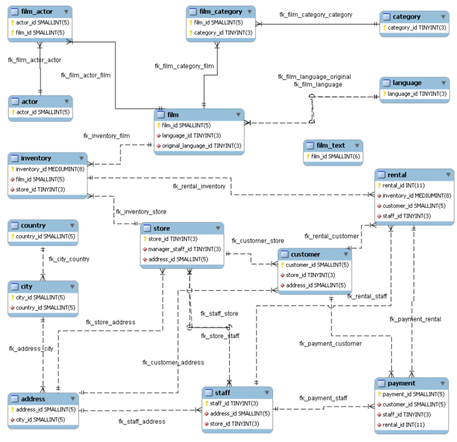

# Setup Sakila Sample Database

## Introduction

The Sakila sample database was initially developed by Mike Hillyer, a former member of the MySQL AB documentation team. It is intended to provide a standard schema that can be used for examples in books, tutorials, articles, samples, and so forth. The Sakila sample database also serves to highlight features of MySQL such as Views, Stored Procedures, and Triggers. 
More details on the Sakila sample database and its usage can be found in the  [Sakila Sample Database page](https://dev.mysql.com/doc/sakila/en/sakila-introduction.html)

_Estimated Time:_ 15 minutes

### Objectives

In this lab, you will be guided through the following tasks:

- Install  Sakila
- Explore the Sakila Database in MySQL


### Prerequisites

This lab assumes you have:

- Completed Labs 2

## Task 1: Install Sakila

1. Connect to **myserver** instance using Cloud Shell (**Example:** ssh -i  ~/.ssh/id_rsa opc@132.145.17….)

    ```
    <copy>ssh -i ~/.ssh/id_rsa opc@<your_compute_instance_ip></copy>
    ```

    

1. Change to home directory
    ```
    <copy>cd /home/opc</copy>
    ```
2. Download the Sakila Database
    ```    
    <copy>wget https://downloads.mysql.com/docs/sakila-db.tar.gz</copy>
    ```
3. Extract the contents of the "sakila-db.tar.gz" archive file. you should see two .sql files: sakila-data.sql and sakila-schema.sql
    ```
    <copy>tar -xvf sakila-db.tar.gz</copy>
    ```
4. Change to the sakila directory
    ```
    <copy>cd sakila</copy>
    ```
5. Connect to the MySQL server. Enter your password when prompted
    ```
    <copy>mysqlsh -uadmin -hlocalhost -p</copy>
    ```
6. Execute the sakila-schema.sql script to create the database structure
    ```
    <copy>SOURCE sakila-schema.sql;</copy>
    ```
7. Execute the sakila-data.sql script to populate the database structure
    ```
    <copy>SOURCE sakila-data.sql;</copy>
    ```
8 Verify the installation
    ```
    <copy>show databses;</copy>
    ```

## Task 2: Explore the Sakila Database in MySQL

1. Point to the sakila dabase

    ```
    <copy>use sakila</copy>
    ```
2. List the sakila tables
    ```
    <copy>show tables</copy>
    ```
3. Here is the ERD (Entity Relationship Diagram) of the Sakila Database.

    

4. Take a look at the actor table
    ```
    <copy>describe actor;</copy>
    ```
5. List data from the actor table
    ```
    <copy>SELECT * FROM actor;</copy>
    ```
3. List data from the film table
    ```
    <copy>SELECT * FROM film;</copy>
    ``` 
3. List data from the film_actor view
    ```
    <copy>SELECT * FROM sakila.film_actor;</copy>
    ``` 
4. Find Overdue DVDs 
    ```
    <copy>SELECT CONCAT(customer.last_name, ', ', customer.first_name) AS customer,
           address.phone, film.title
           FROM rental INNER JOIN customer ON rental.customer_id = customer.customer_id
           INNER JOIN address ON customer.address_id = address.address_id
           INNER JOIN inventory ON rental.inventory_id = inventory.inventory_id
           INNER JOIN film ON inventory.film_id = film.film_id
           WHERE rental.return_date IS NULL
           AND rental_date + INTERVAL film.rental_duration DAY < CURRENT_DATE()
           ORDER BY title
           LIMIT 5;</copy>
    ```

5. Exit
    ```
    <copy>\q</copy>
    ```


You may now **proceed to the next lab**.

## Learn More

- [MySQL Enterprise Edition](https://www.oracle.com/mysql/enterprise/)
- [MySQL Linux Installation](https://dev.mysql.com/doc/en/binary-installation.html)
- [MySQL Shell Installation](https://dev.mysql.com/doc/mysql-shell/en/mysql-shell-install.html)

## Acknowledgements

- **Author** - Perside Foster, MySQL Solution Engineering
- **Contributor** - Nick Mader, MySQL Global Channel Enablement & Strategy Director
- **Last Updated By/Date** - Perside Foster, MySQL Solution Engineering, March  2025
